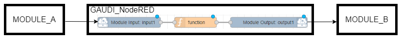
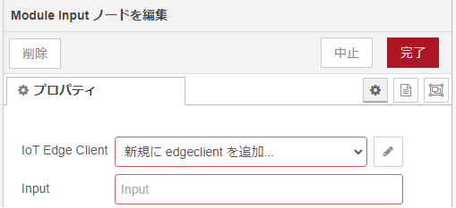
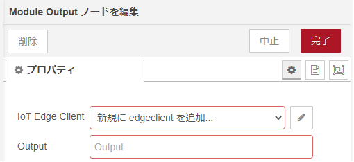
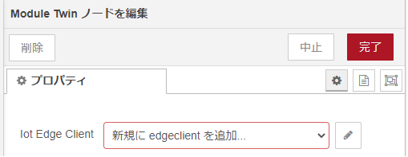
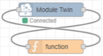
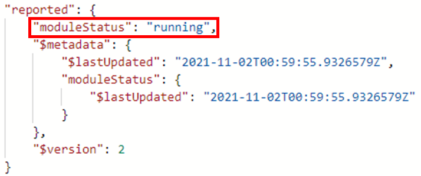
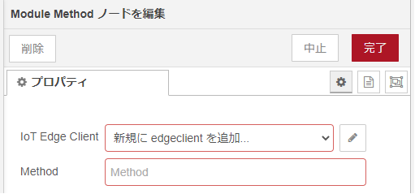
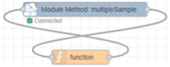
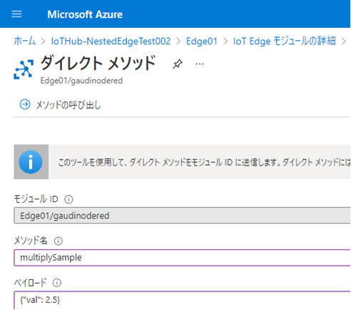
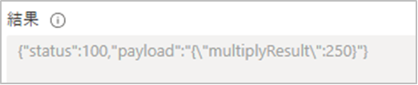

# node-red-iotedge

## 目次

* [概要](#概要)
* [機能](#機能)
* [Deployment 設定値](#deployment-設定値)
  * [環境変数](#環境変数)
  * [Create Option](#create-option)
* [ログ出力内容](#ログ出力内容)
  * [IoTEdgeClient](#iotedgeclient)
  * [Module Input](#module-input)
  * [Module Output](#module-output)
  * [Module Twin](#module-twin)
  * [Module Method](#module-method)
* [Node Specification](#node-specification)
  * [Module Input](#Node-Specification-module-input)
  * [Module Output](#Node-Specification-module-output)
  * [Module Twin](#Node-Specification-module-twin)
  * [Module Method](#Node-Specification-module-method)
* [Feedback](#feedback)
* [LICENSE](#license)
  
## 概要
Azure IoT Edge Node-RED Moduleをベースに一部カスタムを行ったNodeRedのカスタムノードです。

## 機能

AzureのIoTEdgeとの仲介を行う。<br>
以下のノードを含む。

* Module Input/Module Output モジュール間のメッセージ送受信。外部のモジュールからのメッセージ受信、外部のモジュールへのメッセージ送信を行う。<br>

  

* Module Twin モジュールのdesiredプロパティ受信/reportedプロパティ送信。
* Module Method ダイレクトメソッド実行, 結果の送信。

## Deployment 設定値

### 環境変数

本パッケージを利用するモジュールの環境変数に設定する。

#### 環境変数の値

| Key                         | Required | Default | Recommend    | Description                                                                           |
| --------------------------- | -------- | ------- | ------------ | ----------------------------------------------------------------------- |
| AzureIoTMaxOperationTimeout |          | 3600000 |              | EdgeHubとの接続やメッセージ送受信等の通信において再試行が行われた際のタイムアウト時間。単位はミリ秒。<br>下限は240000で、それ未満の数値を設定した場合は下限値を適用する。<br>数値以外の文字など無効な値を設定した場合は、デフォルト値を適用する。 |
| RetryErrorFilter            |          |         |              | <span style="color: red; ">トラブル回避用のため通常時は利用不可</span><br>EdgeHubとの切断時エラーの種類によって再接続の要否を判定する際に用いられるフィルタが存在する。この環境変数でそのフィルタに対し、エラーを新規追加もしくは判定の変更ができる。<br>現状既知のエラーは全て再接続処理に進むよう設定されている。<br>値は"エラー名=[true もしくは false]"の形で設定する。設定した値以外はデフォルト(再接続処理が行われる)から変更されない。<br>trueに設定した場合は、そのエラーにより切断された時再接続処理に入る。<br>falseに設定した場合は、そのエラーにより切断された時再接続処理が行われない。<br>複数指定したい場合は","で繋ぐ。<br>例："xxxxxError=true,TimeoutError=false"で設定した場合はxxxxErrorがフィルタに追加、TimeoutErrorがfalseに変更され、他のエラーはデフォルトのまま再接続処理される設定となる。 |
| MessageSizeLimitExpansion   |          | false   |              | モジュール間のメッセージサイズの上限拡張指定。<br>["true", "false"]<br>true：メッセージサイズ上限が拡張され16MBになる(※1~3)。<br>false：メッセージサイズ上限はデフォルトの256KBになる(※3)。|

※1：**IoTHubへ**のupstreamする際のメッセージサイズ上限は256KBのまま変わらない。<br>
送信してしまった場合、edgeHubからの送信がエラーとなり、その後のメッセージ送信も停滞してしまう。<br>
Edge→Fog間の拡張サイズメッセージの送信は可能。<br>
※2：edgeHubは、メッセージサイズ拡張対応が入っているGAUDIIotEdge-Hubを使用し、edgeHub・送信先モジュールにもMessageSizeLimitExpansion=trueが設定されている必要がある。<br>
※3：送信時にメッセージサイズが増加するため、余裕をとるために1KB引いた値が実際の上限値になる。

### Create Option

#### Create Option の値

(なし)

## ログ出力内容

### IoTEdgeClient

| LogLevel | 出力概要 |
| -------- | -------- |
| error    | [クライアント作成/クライアント接続/ツイン取得/タイムアウト設定]失敗<br>クライアント切断<br>クライアントエラー |
| warn     | 無し        |
| info     | クライアント[作成/接続/close]<br>ツイン作成<br>メッセージサイズ上限拡張設定失敗、デフォルト値設定 |
| debug    | タイムアウト値<br>エラーフィルター一覧<br>最大メッセージサイズ     |
| trace    | ツイン内容<br>タイムアウト設定[開始/取得開始]<br>エラーフィルター[設定取得開始/設定]<br> メッセージサイズ上限拡張設定取得開始       |

### Module Input

| LogLevel | 出力概要 |
| -------- | -------- |
| error    | クライアント取得失敗<br>受信メッセージ出力失敗 |
| warn     | 無し        |
| info     | ノード作成<br>メッセージ受信      |
| debug    | 無し    |
| trace    | 受信メッセージ         |

### Module Output

| LogLevel | 出力概要 |
| -------- | -------- |
| error    | クライアント取得失敗<br>メッセージ送信失敗|
| warn     | 無し        |
| info     | ノード作成<br>メッセージ送信      |
| debug    | 無し    |
| trace    | 送信メッセージ        |

### Module Twin

| LogLevel | 出力概要 |
| -------- | -------- |
| error    | モジュールツインエラー<br>クライアント未初期化 |
| warn     | 無し        |
| info     | desiredProperties更新<br>reportedProperties更新      |
| debug    | 無し    |
| trace    | desiredProperties更新内容         |

### Module Method

| LogLevel | 出力概要 |
| -------- | -------- |
| error    | ダイレクトメソッド返信送信失敗 |
| warn     | 無し        |
| info     | ノード作成<br>ダイレクトメソッド呼び出し<br>ダイレクトメソッド返信成功      |
| debug    | 無し     |
| trace    | ダイレクトメソッドリクエスト<br>受信ダイレクトメソッド         |

## Node Specification

<a id="Node-Specification-module-input"></a>

### Module Input

* 機能概要

  GAUDI-NodeREDモジュールで受信した指定インプット名のメッセージから、Bodyをmsg.payloadに, Propertyをmsg.propertiesにセットし、出力する。<br>

  本ノードを通ると元のメッセージに以下の情報が付与される。

  * topicプロパティ(msg直下): "input"
  * inputプロパティ(msg直下): インプット名
  * $.cdidプロパティ(properties配下): デバイス名
  * $.cmidプロパティ(properties配下): 送信元モジュール名

* プロパティ

  

  | プロパティ      | Type       | Required | Description                                                                                                              |
  | --------------- | ---------- | -------- | ------------------------------------------------------------------------------------------------------------------------ |
  | IoT Edge Client | edgeclient | 〇       | 送受信を行う client のグローバル設定を選択。<br>複数作成することができるが、<br>1 つの NodeRED 環境に 1 つあれば問題ない |
  | Input           | string     | 〇       | インプット名。同一の名前を複数ノードに指定不可。                                                                                                                 |

<span style="color: red; ">Inputプロパティ(インプット名)が同じノードが2つ以上存在する状態でデプロイするとエラーが発生する。

* エラー／例外

  以下の場合、メッセージ受信時に例外を発行する。

  * ModuleClient初期化未実施の場合

* 使用例１

  [プロパティ]

  | プロパティ      | Type       | Value           |
  | --------------- | ---------- | --------------- |
  | IoT Edge Client | edgeclient | IoT Edge Client |
  | Input           | string     | input1          |


  [入力メッセージ]

  ```
  DeviceId = Edge01,
  ModuleId = gaudinodered01,
  Body = { "RecordList": [{ "RecordHeader": ["aaa"], "RecordData": ["bbb"] }] },
  Property = "xxx":"val1","yyy":"val2","zzz":"val3"
  ```

  [出力メッセージ]

  ```json
  {
    "payload": {
      "RecordList": [{ "RecordHeader": ["aaa"], "RecordData": ["bbb"] }]
    },
    "topic": "input",
    "input": "input1",
    "properties": {
      "propertyList": [
        { "key": "xxx", "value": "val1" },
        { "key": "yyy", "value": "val2" },
        { "key": "zzz", "value": "val3" },
        { "key": "$.cdid", "value": "Edge01" },
        { "key": "$.cmid", "value": "csvfilereceiver" }
      ]
    },
    "_msgid": "9647a36a.60ede"
  }
  ```

<a id="Node-Specification-module-output"></a>

### Module Output

* 機能概要

  入力されたメッセージから、msg.payloadをBodyに, msg.propertiesをPropertyにセットし、指定Output名でGAUDI-NodeREDモジュールの出力をする。<br>

  受信したメッセージに対し以下の編集を行う。

  * countメソッド(properties配下): 追加
  * $.cdidプロパティ(properties配下): 削除
  * $.cmidプロパティ(properties配下): 削除

* プロパティ

  

  | プロパティ      | Type       | Required | Description                                                                                                              |
  | --------------- | ---------- | -------- | ------------------------------------------------------------------------------------------------------------------------ |
  | IoT Edge Client | edgeclient | 〇       | 送受信を行う client のグローバル設定を選択。<br>複数作成することができるが、<br>1 つの NodeRED 環境に 1 つあれば問題ない |
  | Output          | string     | 〇       | output 名                                                                                                                |


* エラー／例外

  以下の場合、メッセージ受信時に例外を発行する。

  * ModuleClient初期化未実施の場合
  * msg.payload, msg.propertiesの合計サイズがiothubトピックメッセージの上限サイズを超えている場合
  * プロパティリストの中身が空/オブジェクトではない/キーに"key"が無い/キーに"value"が無い

* 使用例１

  [プロパティ]

  | プロパティ      | Type       | Value           |
  | --------------- | ---------- | --------------- |
  | IoT Edge Client | edgeclient | IoT Edge Client |
  | Output          | string     | output1         |


  [入力メッセージ]

  ```json
  {
    "payload": { "RecordList": [{ "RecordHeader": ["aaa"], "RecordData": ["bbb"] }] },
    "properties": {
      "propertyList": [
        { "key": "xxx", "value": "val1" },
        { "key": "yyy", "value": "val2" },
        { "key": "zzz", "value": "val3" },
        { "key": "$.cdid", "value": "Edge01" },
        { "key": "$.cmid", "value": "csvfilereceiver" }
      ]
    }
  }
  ```

  [出力メッセージ]

  ```
  DeviceId = Edge01,
  ModuleId = gaudinodered01,
  Body = { "RecordList": [{ "RecordHeader": ["aaa"], "RecordData": ["bbb"] }] },
  Property = "xxx":"val1","yyy":"val2","zzz":"val3"
  ```

<a id="Node-Specification-module-twin"></a>

### Module Twin

* 機能概要

  Module Twinメッセージを受け取り、desiredプロパティに設定された値を出力する
  * GAUDI-NodeREDモジュールのdesiredプロパティ更新時にpayloadにdesiredプロパティをセットしてメッセージを出力する
  * メッセージを受信するとreportedプロパティをIoTHubに送信する

* プロパティ

  

  | プロパティ      | Type       | Required | Description                                                                                                              |
  | --------------- | ---------- | -------- | ------------------------------------------------------------------------------------------------------------------------ |
  | IoT Edge Client | edgeclient | 〇       | 送受信を行う client のグローバル設定を選択。<br>複数作成することができるが、<br>1 つの NodeRED 環境に 1 つあれば問題ない |

* エラー／例外

  以下の場合、メッセージ受信時に例外を発行する。

  * 初期化未実施
  * reportedProperties更新失敗の場合

* 使用例１

  desiredプロパティ更新を受けて処理を実行し、reportedプロパティを更新するフロー

  


  [プロパティ]

  | プロパティ      | Type       | Value           |
  | --------------- | ---------- | --------------- |
  | IoT Edge Client | edgeclient | IoT Edge Client |


  [出力メッセージ (desiredプロパティ更新を受信)]

  ```json
  {
    "payload": {
      "testProp": "test1",
      "$version": 5
    },
    "topic": "desired"
  }

  ```

  [入力メッセージ (reportedプロパティを送信)]

  ```json
  {
    "payload": {
      "moduleStatus": "running"
    }
  }
  ```

  [IoTHubでのreportedプロパティ取得結果]

  


<a id="Node-Specification-module-method"></a>

### Module Method

* 機能概要
  * ダイレクトメソッドの入力ペイロードを出力する
  * 入力された情報をダイレクトメソッドの結果として返す

* プロパティ

  

  | プロパティ      | Type       | Required | Description                                                                                                              |
  | --------------- | ---------- | -------- | ------------------------------------------------------------------------------------------------------------------------ |
  | IoT Edge Client | edgeclient | 〇       | 送受信を行う client のグローバル設定を選択。<br>複数作成することができるが、<br>1 つの NodeRED 環境に 1 つあれば問題ない |
  | Method          | string     | 〇       | ダイレクトメソッド名                                                                                                               |
* 入力メッセージ (ダイレクトメソッドの戻り値)
  | msg プロパティ | Required | Description                                             |
  | -------------- | -------- | ------------------------------------------------------- |
  | payload        | &nbsp;   | 文字列化されていなければ文字列化する<br>デフォルト null |
  | status         | 〇       | 数値                                                    |

* エラー／例外

  以下の場合、メッセージ受信時に例外を発行する。

  * ModuleClient初期化未実施
  * ModuleMethod初期化未実施
  * ダイレクトメソッド実行のトリガーが発生し、一定時間内に「Module Method」ノードへ入力がない場合、「Module Method」ノードがエラーを出力する。<br>しかし、このエラーはcatchノードでの受け取りやIoTHub上でのハンドリングができない。<br>そのため、一定時間内に何らかのレスポンスを返す必要がある。

* 使用例１

  受信したペイロードのvalプロパティの数値を100倍して返すフロー

  

  [プロパティ]

  | プロパティ      | Type       | Value           |
  | --------------- | ---------- | --------------- |
  | IoT Edge Client | edgeclient | IoT Edge Client |
  | Method          | string     | multiplySample  |

  [ダイレクトメソッド実行画面]

  

  [出力メッセージ (本ノードが受信したダイレクトメソッドの入力情報)]

  ```json
  {
    "payload": {
      "val": "2.5"
    },
    "topic": "method",
    "method": "multiplySample"
  }
  ```

  [入力メッセージ (ダイレクトメソッドの結果)]

  ```json
  {
    "status": 100,
    "payload": "{\"multiplyResult\":250}"
  }
  ```

  [ポータルでのダイレクトメソッド実行結果]

  

## Feedback
お気づきの点があれば、ぜひIssueにてお知らせください。

## LICENSE
node-red-iotedge is licensed under the MIT License, see the [LICENSE](LICENSE) file for details.